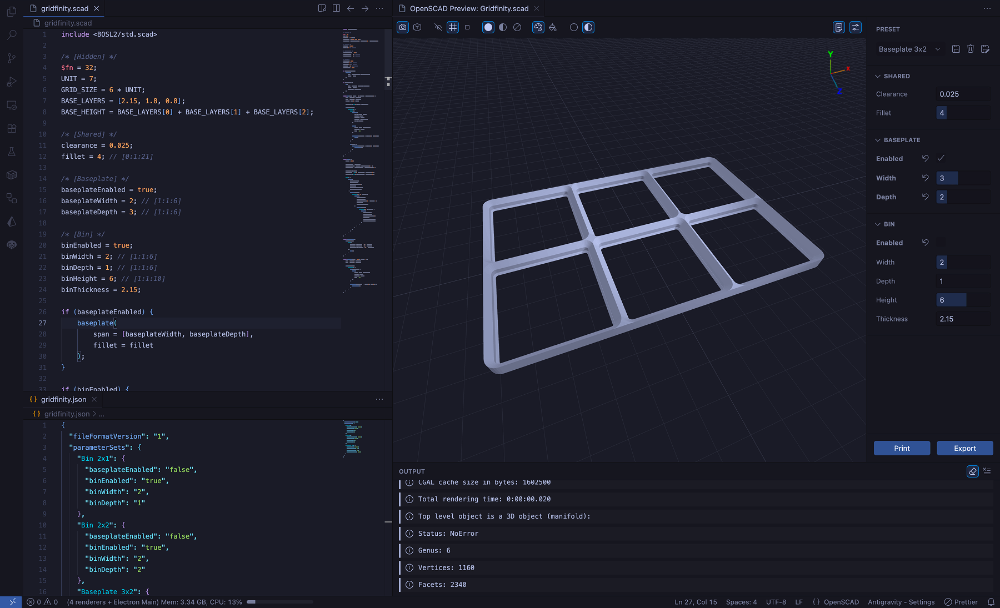

# OpenSCAD Preview

An integrated, interactive 3D preview environment for OpenSCAD (`.scad`) files built for Visual Studio Code. Write your code and instantly visualize your 3D models with robust native UI toolbars, hardware-accelerated rendering, intelligent parameter tweaking, and seamless multi-format slicer integration.

## ✨ Features

### Theme & UI

- **Model Colors:** The default 3D rendering colors dynamically inherit from your active VS Code theme instead of the default OpenSCAD colors, while still respecting custom color declarations from your `.scad` code.
- **UI Theme:** The user interface fully integrates with your active VS Code theme and the recommended standard UI elements.

### 3D Preview

- **Camera Controls:** Switch between perspective and orthographic camera modes.
- **Visual Environments:** Toggle between a familiar grid, an accurate 256mm² build plate, or a blank environment.
- **Render Modes:** Swap between solid, x-ray (translucent), and wireframe rendering.
- **Colors:** Although color declarations in your code are respected, you can toggle them globally, allowing you to switch between a colored and monochrome preview.
- **Lighting:** The scene includes both ambient and directional lighting, with togglable dynamic shadows.

> The preview is rendered using [Three.js](https://threejs.org/), so many additions are possible in the future. [Let me know](https://github.com/thijsdaniels/vscode-openscad-preview/issues) if you have any suggestions!

### Parameters & Presets

- **Live Parameter Controls:** Automatically parses OpenSCAD variables and generates an interactive UI panel. Drag sliders, toggle booleans, and type values while the 3D model hot-reloads instantly.
- **Override Tracking:** Visually track which variables you've overridden in the UI, and click the "Revert" button to instantly fall back to the raw source code value.
- **Save Custom Presets:** Configure your perfect dimensions and save them as named preset groups (stored in local JSON files following the OpenSCAD specification) to seamlessly switch between configurations without code modifications.

### Export & Print

- **1-Click Slicer Handoff:** Fully configured to communicate with external applications. Click the Print button to instantly compile and send your model straight to your preferred software (PrusaSlicer, Bambu Studio, UltiMaker Cura, etc) without the need to store any intermediate files.
- **Format Flexibility:** Supports the universal `STL` format, as well as modern `3MF` files which preserve 3D model color data (requires OpenSCAD Nightly).
  > More formats will be supported in the future.

### CLI Output

- **Dedicated Log UI:** Eliminates terminal spam. The integrated Output panel natively intercepts the OpenSCAD compiler logs.
- **Improved Error Tracing:** Errors and warnings are distinctly highlighted. Multi-line compiler stack traces are grouped into clean collapsible panels for effortless debugging.
- **Auto-Clear Workflow:** Toggle the eraser icon to automatically flush outdated logs when you render a fresh frame.

### Syntax Highlighting & Snippets

- Built-in grammar definitions provide rich syntax highlighting out of the box.
  > This extension does not currently include a language server. For LSP support, I recommend combining this extension with the [OpenSCAD Language Support](https://marketplace.visualstudio.com/items?itemName=Leathong.openscad-language-support) extension by [Leathong](https://marketplace.visualstudio.com/publishers/Leathong).
- Included developer snippets to accelerate your parametric scripting.

## ⚠️ Requirements

- **OpenScad CLI**: A local installation of [OpenSCAD](https://openscad.org/downloads.html#snapshots) must be present on your system path.
  > It is recommended to install a recent nightly build of OpenSCAD to utilize the advanced `3mf` rendering configuration (which preserves `.scad` model colors). The years old stable version (`2021.01`) only supports the monochrome `STL` format.

## 🚀 Getting Started

1. Open any OpenSCAD (`.scad`) file in Visual Studio Code.
2. Click the **Preview Icon** in the top-right editor title bar.
   > Alternatively, trigger `OpenSCAD: Show Preview` in the Command Palette, or use `Cmd+Shift+V` / `Ctrl+Shift+V`.
3. The interactive 3D viewer, parameter editor, and logs will dock directly inside your active IDE!

## ⚙️ Configuration

Customize the extension inside VS Code Settings (`Cmd+,`):

- **`openscad.previewFormat`**: The protocol logic used bridging OpenSCAD to VS Code. Options are `3mf` (default) or `stl`.
- **`openscad.slicerExecutable`**: You can optionally provide the absolute system path to your slicing software. If left blank, your OS's default 3D model handler will be invoked.

## 📝 Feedback

- If you have any feedback, feature requests, or bug reports, please open an issue on the [GitHub repository](https://github.com/thijsdaniels/vscode-openscad-preview).
- If you would like to fork this project or contribute to it by creating a pull request, please feel free to do so! This project is provided under the [MIT license](LICENSE.md).
- If you would like to support the development of this extension, please consider [sponsoring me](https://github.com/sponsors/thijsdaniels).
